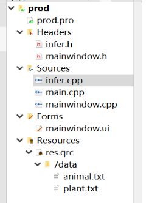
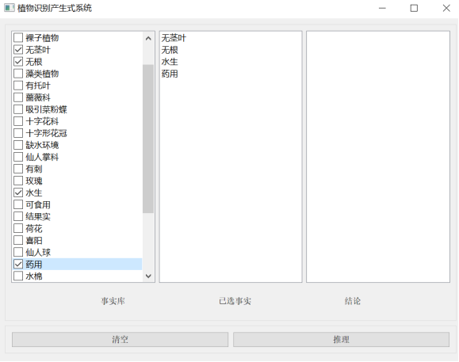

# production_system
迷你一阶谓词产生式系统，实现植物识别的正向推理过程。First order predicate production system，implements the function of plant recognize.

**知识库**

​		用txt文件作文知识库，存入当前已知的所有规则，txt文件中每一行只存放一条规则，所有的规则的集合组成了知识库。infer类的对象在初始化时按行读取规则，使用QFile的readLine()函数，将每条规则转化为一个QString字符串并存入QVector容器中，提供给后去函数进行处理。知识库格式如图：

当知识库中的知识需要改变时，只需增加或删除行，即可对知识库进行修改，而不必更改源代码，程序在重新编译后会自动采用新的知识库，在增加知识时，需要将条件中的各个命题用^进行连接，用->将各个命题合取的结果与结论进行连接。

**推理过程**

​		采用正向推理过程，每推理出一条新的结论，就将新的结论加入已知事实库作为下一次推理的前提。终止条件的判定为，当一次推理后不在产生新的事实，则认为已经找到了能够找到的所有结论，退出推理循环。在推理过程中，按照产生的顺序将推理出的结果加入一个容器中以便后续使用。一下是推理过程的核心函数：

**代码结构**

程序包含一个主函数和两个类。mainwindow类是窗体类，用于把信息展示在窗体上，接受用户的输入，并将程序的输出向用户进行反馈，是用户和算法进行沟通的桥梁。infer类用于处理用户的给出的条件，同时读取知识库中提供的规则，将用户的条件和知识库中的规则进行匹配，产生最终的结果并反馈给窗体。mainwindow.ui是xml文件，采用qtcreator通过这个文件为用户提供了可视化的UI设计方式，允许通过拖拽设计布局animal.txt和plant.txt作为程序的资源文件，提供给程序调用。

**功能展示**

如图是程序界面，用户在左侧的事实库中进行勾选，再次点击可以取消勾选，勾选的事实会实时显示在中间的“已选事实框中”，选择完成后点击“推理”程序会根据用户输入给出结果并显示在右侧“结论”框中。

其中“结论”框中包含多条结论，每条结论按照被推理出的顺序按从上到下显示。此时用户可以再次勾选来取消某条事实并再次推理，也可以直接点击“清除”清空所有信息，以便再次推理。

**打包发布**

animal是课本提供的动物识别系统实现，plant是植物识别系统实现。

打包后包含exe文件和dll库文件放在同一个文件夹下，点击exe文件可以直接运行程序无需编译。

